```mermaid
flowchart TB
    subgraph Entry["ENTRY main.go"]
        main["signal.NotifyContext SIGINT/SIGTERM"]
        blank_import["_ import language/langs<br/>triggers init() registration"]
    end

    main --> blank_import
    blank_import --> rootCmd

    subgraph Commands["COMMANDS"]
        rootCmd["rootCmd cobra"]
        rootCmd --> generate
        rootCmd --> compliance
    end

    generate --> PARSER
    compliance --> LOADER

    subgraph GenerateFlow["GENERATE PIPELINE"]
        direction TB

        subgraph PARSER["1. PARSER"]
            direction TB
            P_fn["parser.Parse"]
            P_desc["git ls-files or WalkDir<br/>hujson.Standardize JSONC<br/>detect lang from schema URL<br/>derive namespace from filename"]
            P_out["OUT: ParseResult<br/>├ Language<br/>├ Configs array<br/>└ Declarations array"]
            P_fn --> P_desc --> P_out
        end

        subgraph INJECTOR["5. INJECTOR"]
            direction TB
            I_in["IN: InjectInput<br/>├ Language string<br/>├ Outputs ConvertResult array<br/>└ OutDir string"]
            I_fn["injector.Inject"]
            I_lookup["lang := language.ByName()"]
            I_build["buildTemplateData()<br/>├ lang.MergeImports()<br/>├ lang.BuildVarName()<br/>├ lang.BuildHeader()<br/>└ lang.BuildFooter()"]
            I_template["template.Execute(lang.Template)"]
            I_write["WriteGeneratedFiles()<br/>├ load previous manifest<br/>├ delete stale files<br/>├ write new files<br/>└ update manifest atomically"]
            I_out["OUT: xschema.gen.ts<br/>└ xschema.manifest.json"]
            I_in --> I_fn --> I_lookup --> I_build --> I_template --> I_write --> I_out
        end
    end

    subgraph ComplianceFlow["COMPLIANCE PIPELINE"]
        direction TB

        subgraph LOADER["1. LOADER"]
            direction TB
            L_fn["compliance.LoadTestSuite"]
            L_desc["fetch JSON Schema Test Suite<br/>cache ~/.cache/xschema<br/>parse tests/draft/*.json<br/>group by keyword"]
            L_out["OUT: TestSuite<br/>├ Draft string<br/>└ Keywords KeywordTests array"]
            L_fn --> L_desc --> L_out
        end

        subgraph HARNESS["2. HARNESS"]
            direction TB
            H_in["IN: KeywordTests<br/>├ Keyword string<br/>└ Tests TestCase array"]
            H_fn["compliance.RunKeyword"]
            H_desc["bundler.Bundle() each schema<br/>extractVocabularyFromSchema()<br/>CallAdapterBatch() direct exec<br/>render lang.HarnessTemplate<br/>exec harness and collect results"]
            H_out["OUT: KeywordResult<br/>├ Passed/Failed/Skipped int<br/>└ Failures array"]
            H_in --> H_fn --> H_desc --> H_out
        end

        subgraph REPORT["3. REPORT"]
            direction TB
            R_in["IN: DraftResult array<br/>├ Draft string<br/>├ Keywords KeywordResult array<br/>└ TotalPass/TotalFail int"]
            R_fn["compliance.GenerateReport"]
            R_desc["write results.json<br/>write results.md"]
            R_in --> R_fn --> R_desc
        end
    end

    PARSER --> RETRIEVER
    LOADER --> HARNESS
    HARNESS --> REPORT

    subgraph Shared["SHARED PACKAGES"]
        direction TB

        subgraph RETRIEVER["2. RETRIEVER"]
            direction TB
            RET_in["IN: Declaration array<br/>├ Namespace/ID string<br/>├ SourceType url/file/json<br/>├ Source json.RawMessage<br/>└ Adapter string"]
            RET_fn["retriever.Retrieve"]
            RET_desc["errgroup concurrent fetch<br/>HTTP retry 3x or read file<br/>in-memory cache"]
            RET_out["OUT: RetrievedSchema array<br/>├ Namespace/ID string<br/>├ Schema json.RawMessage<br/>├ Adapter string<br/>└ SourceURI string"]
            RET_helpers["ALSO EXPORTS:<br/>RetrieveFromURL<br/>RetrieveFromFilePath"]
            RET_in --> RET_fn --> RET_desc --> RET_out
            RET_fn --> RET_helpers
        end

        subgraph PROCESSOR["3. PROCESSOR"]
            direction TB
            PROC_fn["processor.Process"]
            PROC_iface["REQUIRES: Fetcher interface<br/>Fetch ctx uri -> schema<br/>───────────────────────<br/>generate: wraps retriever helpers<br/>compliance: LocalhostFetcher"]

            subgraph PROC_PHASE1["PHASE 1: CRAWL"]
                CRAWL1["scan schema for $ref URIs"]
                CRAWL2["resolve relative URIs against SourceURI"]
                CRAWL3["call Fetcher.Fetch for external refs"]
                CRAWL4["add fetched schemas to cache"]
                CRAWL5["repeat until no new refs found"]
                CRAWL1 --> CRAWL2 --> CRAWL3 --> CRAWL4 --> CRAWL5
            end

            subgraph PROC_PHASE2["PHASE 2: VALIDATE"]
                VAL1["validate declared schemas"]
                VAL2["validate all cached external schemas"]
                VAL3["uses jsonschema v6 library"]
                VAL1 --> VAL2 --> VAL3
            end

            subgraph PROC_PHASE3["PHASE 3: BUNDLE"]
                BUN1["for each declared schema"]
                BUN2["inline all external $refs"]
                BUN3["replace $ref URI with actual schema"]
                BUN4["extract $vocabulary from metaschema"]
                BUN5["produce self-contained schema"]
                BUN1 --> BUN2 --> BUN3 --> BUN4 --> BUN5
            end

            PROC_out["OUT: ProcessedSchema array<br/>├ Schema json.RawMessage BUNDLED<br/>└ Vocabulary map"]

            PROC_fn --> PROC_iface
            PROC_iface --> PROC_PHASE1
            PROC_PHASE1 --> PROC_PHASE2
            PROC_PHASE2 --> PROC_PHASE3
            PROC_PHASE3 --> PROC_out
        end

        subgraph GENERATOR["4. GENERATOR"]
            direction TB
            GEN_fn["generator.GenerateAll"]
            GEN_desc["group by adapter<br/>detect pkg manager<br/>build command bunx/npx/pnpm"]
            GEN_adapter["ADAPTER CLI stdin/stdout"]
            GEN_in["STDIN: ConvertInput array<br/>├ Namespace/ID/VarName string<br/>├ Schema json.RawMessage<br/>└ Vocabulary map"]
            GEN_out["STDOUT: ConvertResult array<br/>├ Namespace/ID/VarName string<br/>├ Imports string array<br/>├ Schema string CODE<br/>└ Type string"]
            GEN_fn --> GEN_desc --> GEN_adapter
            GEN_adapter --> GEN_in
            GEN_adapter --> GEN_out
        end

        subgraph LANGUAGE["LANGUAGE PACKAGE"]
            direction TB
            LANG_registry["language/registry.go<br/>├ Register()<br/>├ ByName()<br/>├ BySchemaURL()<br/>├ SupportedLanguages()<br/>└ AllIgnoreDirs()"]

            subgraph LANG_struct["Language struct"]
                LANG_identity["IDENTITY<br/>├ Name<br/>├ Extensions<br/>├ SchemaURL<br/>└ AdapterBinPrefix"]
                LANG_adapter["ADAPTER INVOCATION<br/>├ DetectRunner()<br/>└ AdapterInvoker.BuildAdapterCommand()"]
                LANG_output["OUTPUT GENERATION<br/>├ Template<br/>├ OutputFile<br/>├ MergeImports()<br/>├ BuildVarName()<br/>├ BuildHeader()<br/>└ BuildFooter()"]
                LANG_dirs["DIRECTORY WALKING<br/>└ IgnoreDirs[]"]
                LANG_harness["COMPLIANCE HARNESS<br/>├ DetectHarnessRunner()<br/>├ HarnessTemplate<br/>├ HarnessExtension<br/>├ GetPackageName()<br/>└ AdapterCLIPath()"]
            end

            LANG_registry --> LANG_struct
        end

        subgraph BUNDLER["BUNDLER"]
            BUND_fn["bundler.Bundle"]
            BUND_desc["recursive $ref resolution<br/>inline external schemas<br/>produce self-contained output"]
        end

        subgraph VALIDATOR["VALIDATOR"]
            VAL_fn["validator.ValidateSchema"]
            VAL_desc["validate against metaschema<br/>uses jsonschema/v6"]
        end

        subgraph METASCHEMA["METASCHEMA"]
            META_fn["metaschema.Get<br/>metaschema.ExtractVocabulary"]
            META_desc["fetch & cache metaschemas<br/>extract $vocabulary map"]
        end

        subgraph ADAPTER["ADAPTER TYPES"]
            ADAP_types["adapter/types.go<br/>├ ConvertInput<br/>└ ConvertResult"]
        end

        subgraph UI["UI lipgloss"]
            UI_desc["Step Spinner Verbosef<br/>SuccessMsg ErrorMsg WarnMsg"]
        end
    end

    %% Pipeline flow (data flows through these)
    RETRIEVER -->|"RetrievedSchema[]"| PROCESSOR
    PROCESSOR -->|"ProcessedSchema[]"| GENERATOR
    GENERATOR -->|"ConvertResult[]"| INJECTOR

    %% Retriever dependencies
    RET_helpers -.->|"wrapped as Fetcher"| PROC_iface
    RETRIEVER -->|"validate on fetch<br/>(redundant with processor)"| VALIDATOR

    %% Processor dependencies
    PROCESSOR -->|"inline $refs"| BUNDLER
    PROCESSOR -->|"validate all"| VALIDATOR
    PROCESSOR -->|"extract $vocabulary"| METASCHEMA

    %% Generator dependencies
    GENERATOR -->|"BuildAdapterCommand"| LANGUAGE
    GENERATOR -->|"I/O types"| ADAPTER

    %% Injector dependencies
    INJECTOR -->|"Template MergeImports<br/>BuildVarName OutputFile"| LANGUAGE
    INJECTOR -->|"ConvertResult type"| ADAPTER

    %% Parser dependencies
    PARSER -->|"BySchemaURL<br/>AllIgnoreDirs"| LANGUAGE

    %% Compliance dependencies (does NOT use processor or generator)
    HARNESS -->|"bundler.Bundle()"| BUNDLER
    HARNESS -->|"HarnessTemplate<br/>DetectHarnessRunner"| LANGUAGE
    HARNESS -->|"CallAdapterBatch()<br/>uses adapter types"| ADAPTER

    %% UI (dotted = logging only)
    GenerateFlow -.->|"logging"| UI
    ComplianceFlow -.->|"logging"| UI

    style Entry fill:#e1f5fe,stroke:#0288d1
    style Commands fill:#fff3e0,stroke:#f57c00
    style GenerateFlow fill:#e8f5e9,stroke:#388e3c,stroke-width:2px
    style ComplianceFlow fill:#fce4ec,stroke:#c2185b,stroke-width:2px
    style Shared fill:#fffde7,stroke:#f9a825,stroke-width:2px
    style RETRIEVER fill:#fff59d
    style PROCESSOR fill:#fff59d
    style GENERATOR fill:#fff59d
    style LANGUAGE fill:#c8e6c9
    style BUNDLER fill:#fff59d
    style VALIDATOR fill:#fff59d
    style METASCHEMA fill:#fff59d
    style ADAPTER fill:#fff59d
    style UI fill:#fff59d
    style PROC_PHASE1 fill:#ffecb3,stroke:#ff8f00
    style PROC_PHASE2 fill:#ffecb3,stroke:#ff8f00
    style PROC_PHASE3 fill:#ffecb3,stroke:#ff8f00
    style LANG_struct fill:#a5d6a7
```

## Module Dependencies (actual Go imports)

```
parser
  └─ language        # BySchemaURL() to detect lang, AllIgnoreDirs() for walking

retriever
  ├─ parser          # Declaration type (input)
  └─ validator       # validate on fetch (redundant with processor Phase 2)

processor
  ├─ retriever       # RetrievedSchema type (input)
  ├─ bundler         # Bundle() to inline external $refs
  ├─ validator       # ValidateSchema() for declared + external schemas
  └─ metaschema      # Get() and ExtractVocabulary()

generator
  ├─ processor       # ProcessedSchema type (input)
  ├─ language        # AdapterInvoker.BuildAdapterCommand()
  └─ adapter         # ConvertInput/ConvertResult types

injector
  ├─ language        # Template, OutputFile, MergeImports(), BuildVarName()
  └─ adapter         # ConvertResult type (input)

bundler
  └─ (none)          # self-contained, only uses stdlib + ui

compliance
  ├─ bundler         # Bundle() directly (skips processor - no crawl/validation)
  ├─ language        # HarnessTemplate, DetectHarnessRunner()
  ├─ adapter         # ConvertInput/ConvertResult for CallAdapterBatch() (skips generator)
  └─ (own impl)      # extractVocabularyFromSchema() - own $vocabulary extraction
```

## Why Each Dependency Exists

| From | To | Why |
|------|-----|-----|
| **retriever** → validator | validates on fetch (redundant - processor validates again in Phase 2) |
| **retriever** → parser | uses `parser.Declaration` as input type |
| **processor** → retriever | uses `retriever.RetrievedSchema` as input type |
| **processor** → bundler | calls `bundler.Bundle()` to inline all external $refs |
| **processor** → validator | validates declared schemas + all discovered external schemas |
| **processor** → metaschema | fetches metaschemas, extracts `$vocabulary` map for adapters |
| **generator** → processor | uses `processor.ProcessedSchema` as input type |
| **generator** → language | calls `AdapterInvoker.BuildAdapterCommand()` to construct adapter CLI |
| **generator** → adapter | uses `adapter.ConvertInput/ConvertResult` for stdin/stdout contract |
| **injector** → language | uses `Template`, `OutputFile`, `MergeImports()`, `BuildVarName()` |
| **injector** → adapter | uses `adapter.ConvertResult` as input type |
| **parser** → language | `BySchemaURL()` detects lang from config, `AllIgnoreDirs()` for walking |
| **compliance** → bundler | calls `bundler.Bundle()` directly (skips processor - no crawl, no validation) |
| **compliance** → language | uses `HarnessTemplate`, `DetectHarnessRunner()` for test execution |
| **compliance** → adapter | uses types for `CallAdapterBatch()` which calls adapter directly (skips generator) |

## Language Package Usage Map

| Consumer | Functions Used | Purpose |
|----------|----------------|---------|
| **parser** | `BySchemaURL()` | detect language from config `$schema` URL |
| **parser** | `AllIgnoreDirs()` | skip dirs when walking (node_modules, dist) |
| **parser** | `ByName()` | lookup language when filtering by `--lang` |
| **generator** | `ByName()` | get language config for adapter invocation |
| **generator** | `AdapterInvoker.BuildAdapterCommand()` | build command to run adapter |
| **generator** | `BuildVarName()` | create safe variable names for schemas |
| **injector** | `ByName()` | get template, output file config |
| **injector** | `Template` | Go text/template for output file |
| **injector** | `OutputFile` | where to write (e.g., "xschema.gen.ts") |
| **injector** | `MergeImports()` | dedupe and format import statements |
| **injector** | `BuildHeader()` / `BuildFooter()` | language-specific boilerplate |
| **injector** | `BuildVarName()` | build variable names for schemas |
| **compliance** | `DetectHarnessRunner()` | get test runner (bun/node) |
| **compliance** | `HarnessTemplate` | template for harness file |
| **compliance** | `GetPackageName()` / `AdapterCLIPath()` | adapter binary location |

## Initialization Sequence

```
1. main.go imports: _ "language/langs"
2. language/langs/langs.go init() imports typescript package
3. typescript/typescript.go init() calls language.Register(Language())
4. global registry now populated
5. main() → cmd.Execute(ctx)
6. commands lookup via language.ByName() / language.BySchemaURL()
```

## Injector Detail

The injector transforms adapter output into final source files:

1. **Lookup**: `lang := language.ByName(input.Language)`
2. **Build template data**:
   - collect all imports from outputs
   - `mergedImports := lang.MergeImports(allImports)` — TypeScript: dedupe, sort
   - for each output: `varName := lang.BuildVarName(namespace, id)`
   - `header := lang.BuildHeader(outDir, schemas)` — "export const schemas = {"
   - `footer := lang.BuildFooter(outDir, schemas)` — "}"
3. **Render**: `template.Execute(lang.Template, data)`
4. **Write files**:
   - load previous `xschema.manifest.json`
   - identify stale files (in old manifest but not new)
   - delete stale files
   - write new files
   - update manifest atomically

## Package Independence Ranking

Most independent → most connected:

1. **bundler** - only stdlib + ui, fully self-contained
2. **validator** - only external lib (jsonschema/v6)
3. **metaschema** - only HTTP fetching
4. **adapter** - pure type definitions, no logic
5. **language** - global registry, no deps on pipeline
6. **parser** - depends on language
7. **retriever** - depends on parser, validator
8. **injector** - depends on language, adapter
9. **generator** - depends on processor, language, adapter
10. **processor** - hub: bundler, metaschema, validator, retriever
