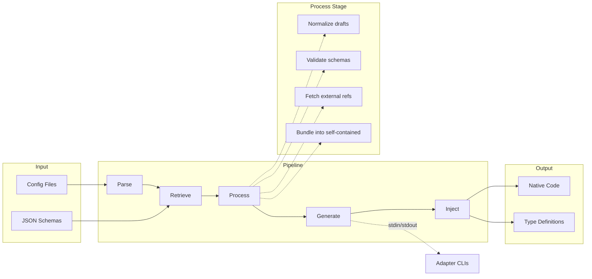

import { Callout } from "fumadocs-ui/components/callout";
import { Cards, Card } from "fumadocs-ui/components/card";
import { Code, Zap, BookOpen } from "lucide-react";

## Philosophy

xschema exists because **JSON Schema is a standard, but the tooling isn't**.

Every validation library implements JSON Schema differently. Some support `$ref`, some don't. Some handle draft differences, most don't document what they support. When validation fails silently because a keyword was ignored, you find out in production.

xschema's approach:

1. **Compliance-first** - Every adapter runs against the official JSON Schema Test Suite. You see exactly what percentage of the spec is supported.

2. **Build-time generation** - Schemas are converted to native validator code at build time. No runtime parsing, no bundle bloat from unused keywords.

3. **Do the hard work upfront** - The CLI handles ref resolution, draft normalization, and validation before adapters see anything. Adapters stay simple and focused.

4. **Transparency over magic** - When something isn't supported, you know immediately. No silent failures, no guessing what keywords are ignored.

## Architecture

xschema uses a five-stage pipeline where each stage does one thing well:

### What each stage does

| Stage | Responsibility |
|-------|----------------|
| **Parse** | Discovers config files, extracts declarations, detects language |
| **Retrieve** | Fetches schemas from file/URL/inline, handles headers and env vars |
| **Process** | Normalizes drafts, validates against meta-schema, resolves `$ref`, bundles |
| **Generate** | Calls adapter CLIs with bundled schemas, collects generated code |
| **Inject** | Writes output files using language templates, tracks manifest |

### Why this matters

The **Process** stage does the heavy lifting that other tools push to adapters:

- **Draft normalization**: Converts draft 3/4/6/7/2019-09 to draft 2020-12
- **Ref resolution**: Fetches external `$ref` targets recursively
- **Bundling**: Produces self-contained schemas with no external dependencies
- **Validation**: Catches invalid schemas before generation

By the time an adapter receives a schema, it's:
- Normalized to a single draft (2020-12)
- Self-contained (all `$ref`s point to local `$defs`)
- Already validated against the meta-schema

This separation means adapters only need ~500 lines of code to achieve 100% compliance.

## Adapter Protocol

Adapters are standalone CLIs that communicate with the xschema CLI via stdin/stdout JSON. The CLI sends pre-bundled, normalized schemas; adapters return generated code.

This separation keeps adapters simple (~500 lines for 100% compliance) while the CLI handles the complex work of draft normalization, ref resolution, and validation.

See the [Adapter Protocol](/docs/adapters/protocol) reference for the complete specification.
