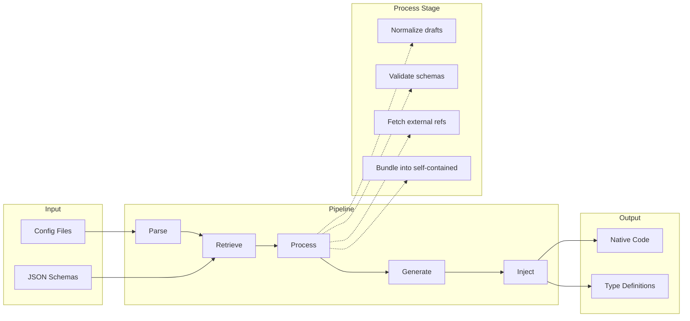

import { Callout } from "fumadocs-ui/components/callout";
import { Cards, Card } from "fumadocs-ui/components/card";

## Philosophy

xschema exists because **JSON Schema is a standard, but the tooling isn't**.

Every validation library implements JSON Schema differently. Some support `$ref`, some don't. Some handle draft differences, most don't document what they support. When validation fails silently because a keyword was ignored, you find out in production.

xschema's approach:

1. **Compliance-first** - Every adapter runs against the official JSON Schema Test Suite. You see exactly what percentage of the spec is supported.

2. **Build-time generation** - Schemas are converted to native validator code at build time. No runtime parsing, no bundle bloat from unused keywords.

3. **Do the hard work upfront** - The CLI handles ref resolution, draft normalization, and validation before adapters see anything. Adapters stay simple and focused.

4. **Transparency over magic** - When something isn't supported, you know immediately. No silent failures, no guessing what keywords are ignored.

## Architecture

xschema uses a five-stage pipeline where each stage does one thing well:

### What each stage does

| Stage | Responsibility |
|-------|----------------|
| **Parse** | Discovers config files, extracts declarations, detects language |
| **Retrieve** | Fetches schemas from file/URL/inline, handles headers and env vars |
| **Process** | Normalizes drafts, validates against meta-schema, resolves `$ref`, bundles |
| **Generate** | Calls adapter CLIs with bundled schemas, collects generated code |
| **Inject** | Writes output files using language templates, tracks manifest |

### Why this matters

The **Process** stage does the heavy lifting that other tools push to adapters:

- **Draft normalization**: Converts draft 3/4/6/7/2019-09 to draft 2020-12
- **Ref resolution**: Fetches external `$ref` targets recursively
- **Bundling**: Produces self-contained schemas with no external dependencies
- **Validation**: Catches invalid schemas before generation

By the time an adapter receives a schema, it's:
- Normalized to a single draft (2020-12)
- Self-contained (all `$ref`s point to local `$defs`)
- Already validated against the meta-schema

This separation means adapters only need ~500 lines of code to achieve 100% compliance.

## Comparison

### vs json-schema-to-zod

[json-schema-to-zod](https://github.com/StefanTerdell/json-schema-to-zod) converts JSON Schema to Zod schemas.

| Feature | xschema | json-schema-to-zod |
|---------|---------|-------------------|
| Compliance tested | Yes (100% on Zod) | No |
| External `$ref` resolution | Yes, recursive | Limited |
| Draft normalization | All drafts → 2020-12 | Partial |
| Multiple adapters | Zod, ArkType, Effect, Valibot | Zod only |
| Runtime mode | Planned | Yes |
| Config-driven | Yes | No |

**Choose json-schema-to-zod if:** You need runtime conversion or a single ad-hoc transform.

**Choose xschema if:** You want tested compliance, multiple adapter options, or a build-time workflow.

### vs TypeBox

[TypeBox](https://github.com/sinclairzx81/typebox) is a TypeScript-first schema builder that can emit JSON Schema.

| Feature | xschema | TypeBox |
|---------|---------|---------|
| Direction | JSON Schema → validators | TypeScript → JSON Schema |
| Source of truth | JSON Schema | TypeScript types |
| Existing schemas | Yes, any JSON Schema | Must rewrite in TypeBox |
| Language support | TypeScript, Python (planned) | TypeScript only |
| Validation library | Your choice (Zod, etc.) | TypeBox's built-in validator |

**Choose TypeBox if:** You're starting fresh and want TypeScript as your schema source.

**Choose xschema if:** You have existing JSON Schemas, use OpenAPI, or need a specific validator.

### vs Zod (directly)

Zod is excellent for writing schemas in TypeScript. The comparison is about workflow, not quality.

| Approach | When to use |
|----------|-------------|
| **Zod directly** | TypeScript is your source of truth |
| **xschema → Zod** | JSON Schema is your source of truth (OpenAPI, API contracts, shared schemas) |

If you're already using Zod and don't have external JSON Schemas, you don't need xschema.

## When to use xschema

<Cards>
  <Card title="You have JSON Schemas" icon="FileJson">
    OpenAPI specs, API contracts, shared schema definitions
  </Card>
  <Card title="You need compliance guarantees" icon="ShieldCheck">
    Know exactly which keywords work, with test results
  </Card>
  <Card title="You want adapter flexibility" icon="Puzzle">
    Switch between Zod, ArkType, Effect, or Valibot
  </Card>
  <Card title="You use multiple languages" icon="Languages">
    TypeScript today, Python tomorrow (same schemas)
  </Card>
</Cards>

## When not to use xschema

<Callout type="info">
xschema isn't always the right tool. Here's when to skip it:
</Callout>

- **TypeScript is your source of truth** - Use Zod, ArkType, or TypeBox directly
- **You need runtime conversion** - xschema is build-time only (runtime mode planned)
- **Single ad-hoc conversion** - json-schema-to-zod is simpler for one-off transforms
- **You need `$dynamicRef`** - Not supported (can't be statically compiled)

## Next steps

<Cards>
  <Card 
    title="Getting Started" 
    description="Set up xschema in 5 minutes"
    href="/docs/getting-started"
    icon="Rocket"
  />
  <Card 
    title="Adapters" 
    description="Compare Zod, ArkType, Effect, Valibot"
    href="/docs/adapters"
    icon="Puzzle"
  />
  <Card 
    title="Compliance" 
    description="See test results for each adapter"
    href="/docs/compliance"
    icon="ShieldCheck"
  />
</Cards>
