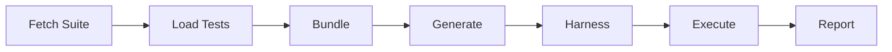

import { Steps, Step } from "fumadocs-ui/components/steps";

xschema tests adapters against the official [JSON Schema Test Suite](https://github.com/json-schema-org/JSON-Schema-Test-Suite) to verify correctness. This page explains how the compliance testing pipeline works internally. For command-line usage, see the [CLI Reference](/docs/cli/compliance).

## Testing Pipeline Overview

The compliance runner executes a 7-step pipeline:



<Steps>
<Step>
### Fetch Test Suite

The JSON Schema Test Suite is downloaded from GitHub and cached locally:

```
~/.cache/xschema/json-schema-test-suite-{version}/
```

The version is pinned to ensure reproducible results. If the cache exists, no download occurs.
</Step>

<Step>
### Load Test Cases

Test cases are loaded from the suite's `tests/{draft}/` directories. Each JSON file contains test groups for a specific keyword:

```json
// tests/draft2020-12/additionalProperties.json
[
  {
    "description": "additionalProperties being false does not allow...",
    "schema": { ... },
    "tests": [
      { "description": "no additional properties is valid", "data": {}, "valid": true },
      { "description": "an additional property is invalid", "data": {"foo": 1}, "valid": false }
    ]
  }
]
```
</Step>

<Step>
### Bundle Schemas

Each test schema is processed through the same bundler used by `xschema generate`:

1. **Normalize** to draft 2020-12 syntax (if using older draft)
2. **Resolve** external `$ref` references
3. **Flatten** nested `$defs` to root level
4. **Validate** against meta-schema

This ensures adapters receive the same input format as production use.
</Step>

<Step>
### Generate Code via Adapter

The bundled schemas are sent to the adapter CLI via stdin/stdout JSON protocol:

**Input:**
```json
[{ "namespace": "test", "id": "schema_0", "varName": "test_schema_0", "schema": {...} }]
```

**Output:**
```json
[{ "namespace": "test", "id": "schema_0", "varName": "test_schema_0", "schema": "z.object(...)", "type": "..." }]
```
</Step>

<Step>
### Generate Test Harness

A language-specific test harness is generated that:
1. Imports the generated validators
2. Runs each test case against the validator
3. Compares actual output to expected `valid` value
4. Reports pass/fail for each test
</Step>

<Step>
### Execute Tests

The harness is executed (e.g., via `bun run`) and results are collected. Each test is marked as:

| Result | Meaning |
|--------|---------|
| **Passed** | Output matched expected `valid` value |
| **Failed** | Output didn't match expected value |
| **Skipped** | Adapter returned type-only output (no runtime validator) |
| **Unsupported** | Test uses features that can't be statically compiled |
</Step>

<Step>
### Report Results

Results are aggregated by keyword and draft, then either:
- Printed to terminal (default)
- Written to `compliance/results/` (with `--dev-report`)
</Step>
</Steps>

## Coverage Calculation

Coverage is calculated excluding unsupported features:

```
Coverage = Passed / (Total - Unsupported) * 100
```

### Why Exclude Unsupported Features?

Some JSON Schema features cannot be implemented with static code generation. These are **fundamental limitations**, not bugs:

- **`$dynamicRef` / `$dynamicAnchor`** - Requires runtime scope tracking to resolve references based on the validation call path
- **`$recursiveRef` / `$recursiveAnchor`** - Same dynamic resolution behavior (draft 2019-09 predecessor)
- **`unevaluatedProperties` / `unevaluatedItems` with applicators** - Requires annotation tracking across schema branches

Since these features cannot be supported by any static validator, including their tests would artificially deflate compliance percentages. A 100% compliant adapter means it correctly implements all *implementable* features.

See [Unsupported Features](/docs/compliance/unsupported-features) for detailed explanations.

## Unsupported Feature Detection

The compliance runner detects unsupported features using pattern matching on test paths and schema content:

### Detection Methods

1. **Test path matching** - Certain test files are known to test unsupported features:
   - `dynamicRef.json`, `recursiveRef.json`
   - Specific test descriptions mentioning dynamic behavior

2. **Schema keyword scanning** - Schemas containing forbidden keywords:
   - `$dynamicRef`, `$dynamicAnchor`
   - `$recursiveRef`, `$recursiveAnchor`

3. **Annotation requirement detection** - Tests requiring annotation tracking:
   - `unevaluatedProperties` combined with `allOf`, `anyOf`, `oneOf`, `if`, `$ref`
   - `unevaluatedItems` with applicator keywords

### Unsupported Feature Registry

The list of unsupported features is maintained in `cli/unsupported/unsupported-features.json`. This file is version-controlled and used by:

1. **Compliance runner** - To classify tests
2. **Docs generator** - To create the [Unsupported Features](/docs/compliance/unsupported-features) page

## Schema Preprocessing

Before adapters see test schemas, significant preprocessing occurs:

| Processing Step | Purpose |
|-----------------|---------|
| Draft normalization | Convert legacy syntax to 2020-12 |
| `$ref` resolution | Embed external references |
| `$defs` flattening | Lift nested definitions to root |
| Anchor resolution | Convert anchors to JSON pointers |
| Meta-schema validation | Ensure schema is valid |

This means adapters receive **clean, bundled, normalized** schemas - the same format they'd receive during normal `xschema generate` usage.

### Draft Normalization Examples

| Legacy Syntax | Normalized (2020-12) |
|---------------|----------------------|
| `items` (array form) | `prefixItems` |
| `additionalItems` | `items` |
| `exclusiveMaximum: true` + `maximum` | `exclusiveMaximum: number` |
| `definitions` | `$defs` |
| `id` | `$id` |

## Report Generation

When running with `--dev-report`, results are written to the adapter's `compliance/results/` directory:

```
typescript/packages/adapters/zod/compliance/results/
  draft2020-12.json   # Detailed results for each draft
  draft2019-09.json
  draft7.json
  draft6.json
  draft4.json
  draft3.json
  REPORT.md           # Human-readable summary
```

### JSON Format

Each draft produces a JSON file with structured results:

```json
{
  "draft": "draft2020-12",
  "keywords": [
    {
      "keyword": "additionalProperties",
      "passed": 24,
      "failed": 0,
      "skipped": 0,
      "total": 24,
      "failures": []
    }
  ],
  "summary": {
    "passed": 1234,
    "failed": 0,
    "skipped": 0,
    "total": 1234,
    "percentage": 100.0,
    "unsupportedFeatures": {
      "count": 42,
      "items": ["$dynamicRef", "$recursiveRef", ...]
    }
  }
}
```

### Docs Generation Flow

Compliance results flow into documentation:

```
xschema compliance --dev-report
        │
        ▼
compliance/results/*.json
        │
        ▼
web/scripts/generate-compliance.ts
        │
        ▼
web/content/docs/adapters/{adapter}/compliance.mdx
```

## Supported Drafts

The compliance runner tests against all major JSON Schema drafts:

| Draft | Status |
|-------|--------|
| draft2020-12 | Latest, primary target |
| draft2019-09 | Supported |
| draft7 | Supported |
| draft6 | Supported |
| draft4 | Supported |
| draft3 | Supported |

All schemas are normalized to draft2020-12 internally, so adapters only need to handle modern syntax.


